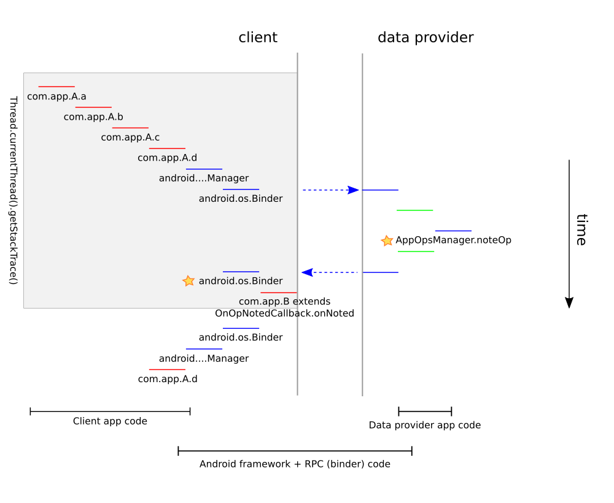

<!--
  Copyright (C) 2020 The Android Open Source Project

  Licensed under the Apache License, Version 2.0 (the "License");
  you may not use this file except in compliance with the License.
  You may obtain a copy of the License at

       http://www.apache.org/licenses/LICENSE-2.0

  Unless required by applicable law or agreed to in writing, software
  distributed under the License is distributed on an "AS IS" BASIS,
  WITHOUT WARRANTIES OR CONDITIONS OF ANY KIND, either express or implied.
  See the License for the specific language governing permissions and
  limitations under the License
  -->

# App-ops

App-ops are used for two purposes: Access control and tracking.

App-ops cover a wide variety of functionality from helping with runtime permissions to battery
consumption tracking.

App-ops are defined in `AppOpsManager` as `OP_...` and need to be continuously numbered. The
integer values of the app-ops are not exposed. For app-ops visible to 3rd party apps,
the name of the app-op might be exposed as `OPSTR_`. As the integers are not part of the API, they
might (and have) changed between platform versions and OEM implementations.
`AppOpsManager.opToPublicName` and `AppOpsManager.strOpToOp` allow for conversion between integer
and string identifier for the op.

## App-ops as access restrictions

App-ops can either be controlled for each [uid](../os/Users.md#int-uid) or for each package. Which
one is used depends on the API provider maintaining this app-op.

For any security or privacy related app-ops the provider needs to control the app-op per uid
as all security and privacy is based on uid in Android.

App-op used for non-security related tasks are usually controlled per package to provide finer
granularity.

### Setting the app-op mode

To control access the app-op can be set to:

`MODE_DEFAULT`
: Default behavior, might differ from app-op to app-op

`MODE_ALLOWED`
: Allow the access

`MODE_FOREGROUND`
: Allow the access but only if the app is currently in the [foreground](#foreground)

`MODE_IGNORED`
: Don't allow the access, i.e. don't perform the requested action or return placeholder data

`MODE_ERRORED`
: Throw a `SecurityException` on access. This can be suppressed by using a `...noThrow` method to
check the mode

The initial state of an app-op is defined in its `AppOpInfo`. Confusingly the initial state is not
always `MODE_DEFAULT`, if `AppOpInfo.Builder.setDefaultMode()` is called with a different mode.

Per-package modes can be set using `AppOpsManager.setMode` and per-uid modes can be set using
`AppOpsManager.setUidMode`.

**Warning**: Do not use `setMode` and `setUidMode` for the same app-op. Due to the way the
internal storage for the mode works this can lead to very confusing behavior. If this ever happened
by accident this needs to be cleaned up for any affected user as the app-op mode is retained over
reboot.

App-ops can also be set via the shell using the `appops set` command. The target package/uid can be
defined via parameters to this command.

The current state of the app-op can be read via the `appops get` command or via `dumpsys appops`.
If the app-op is not mentioned in the output the app-op is in it's initial state.

For example `dumpsys appops`:
```
[...]
  Uid 2000:
    [...]
      COARSE_LOCATION: mode=foreground
      START_FOREGROUND: mode=foreground
      LEGACY_STORAGE: mode=ignore
    [...]
```

### Guarding access based on app-ops

API providers need to check the mode returned by `AppOpsManager.noteOp` if they are are allowing
access to operations gated by the app-op. `AppOpsManager.unsafeCheckOp` should be used to check the
mode if no access is granted. E.g. this can be for displaying app-op state in the UI or when
checking the state before later calling `noteOp` anyway.

If an operation refers to a time span (e.g. a audio-recording session) the API provider should
use `AppOpsManager.startOp` and `AppOpsManager.finishOp` instead of `noteOp`.

`noteOp` and `startOp` take a `packageName` and `attributionTag` parameter. These need to be read
from the calling app's context as `Context.getOpPackageName` and `Context.getAttributionTag`, then
send to the data provider and then passed on the `noteOp`/`startOp` method.

#### App-ops and permissions

Access guarding is often done in combination with permissions using [runtime permissions
](../permission/Permissions.md#runtime-permissions-and-app-ops) or [app-op permissions
](../permission/Permissions.md#app-op-permissions). This is preferred over just using an app-op
 as permissions a concept more familiar to app developers.

### Foreground

The `AppOpsService` tracks the apps' proc state (== foreground-ness) by following the
`ActivityManagerService`'s proc state. It reduces the possible proc states to only those needed
for app-ops. It also delays the changes by a _settle time_. This delay is needed as the proc state
can fluctuate when switching apps. By delaying the change the appops service is not affected by
those.

In addition to proc state, the `AppOpsService` also receives process capability update from the
`ActivityManagerService`. Proc capability specifies what while-in-use(`MODE_FOREGROUND`) operations
 the proc is allowed to perform in its current proc state. There are three proc capabilities
 defined so far: 
`PROCESS_CAPABILITY_FOREGROUND_LOCATION`, `PROCESS_CAPABILITY_FOREGROUND_CAMERA` and
`PROCESS_CAPABILITY_FOREGROUND_MICROPHONE`, they correspond to the while-in-use operation of
location, camera and microphone (microphone is `RECORD_AUDIO`).

In `ActivityManagerService`, `PROCESS_STATE_TOP` and `PROCESS_STATE_PERSISTENT` have all
three capabilities, `PROCESS_STATE_FOREGROUND_SERVICE` has capabilities defined by
 `foregroundServiceType` that is specified in foreground service's manifest file. A client process 
 can pass its capabilities to service using `BIND_INCLUDE_CAPABILITIES` flag.

The proc state and capability are used for two use cases: Firstly, Tracking remembers the proc state
 for each tracked event. Secondly, `noteOp`/`checkOp` calls for app-op that are set to
 `MODE_FOREGROUND` are translated using the `AppOpsService.UidState.evalMode` method into
 `MODE_ALLOWED` when the app has the capability and `MODE_IGNORED` when the app does not have the 
 capability. `checkOpRaw` calls are not affected.

The current proc state and capability for an app can be read from `dumpsys appops`.
The tracking information can be read from `dumpsys appops`

```
Uid u0a118:
  state=fg
  capability=6
```

## Instantaneous and long running ops

Some events such as reading the last known location as instantaneous ops, i.e. they happen
without taking any relevant time. The data provider should use `noteOp` to signal to the system
that such an event happened.

For events that take some time (such as recording a video) the data provider should call `startOp`
at the beginning of the event and `finishOp` at the end of th event. It is uncommon but possible
that at a given time multiple such events are in progress and hence this is properly handled.
While such an event is in progress the app-op is considered `active`.

For some ops both instantaneous and long running ops are recorded, e.g. recoding a video and taking
a picture.

## Forwarding (==proxying) operations to another process

Some apps are forwarding access to other apps. E.g. an app might get the location from the
system's location provider and then send the location further to a 3rd app. In this case the
app passing on the data needs to call `AppOpsManager.noteProxyOp` to signal the access proxying.
This might also make sense inside of a single app if the access is forwarded between two
attribution tags of the app. In this case an app-op is noted for the forwarding app (proxy) and
the app that received the data (proxied). As any app can do it is important to track how much the
system trusts this proxy-access-tracking. For more details see `AppOpService.noteProxyOperation`.

## App-ops for tracking

App-ops track many important events, including all accesses to runtime permission protected
APIs. This is done by tracking when an app-op was noted or started. The tracked data can only be
read by system components.

**Note:** Only `noteOp`/`startOp` calls are tracked; `unsafeCheckOp` is not tracked. Hence it is
important to eventually call `noteOp` or `startOp` when providing access to protected operations
or data.

The tracking information can be read from `dumpsys appops` split by attribution tag, proc state and
proxying information with the syntax

```
Package THE_PACKAGE_NAME:
  AN_APP_OP (CURRENT_MODE):
    ATTRIBUTION_TAG (or null for default attribution)=[
      ACCESS_OR_REJECT: [PROC_STATE-PROXYING_TAG] TIME proxy[INFO_ABOUT_PROXY IF_PROXY_ACCESS]
```

Example:

```
Package com.google.android.gms:
  READ_CONTACTS (allow):
    null=[
      Access: [fgsvc-s] 2020-02-14 14:24:10.559 (-3d23h15m43s642ms)
      Access: [fgsvc-tp] 2020-02-14 14:23:58.189 (-3d23h15m56s12ms)
    ]
    apkappcontext=[
      Access: [fg-tp] 2020-02-17 14:24:54.721 (-23h14m59s480ms)
    ]
    com.google.android.gms.icing=[
      Access: [fgsvc-tpd] 2020-02-14 14:26:27.018 (-3d23h13m27s183ms) proxy[uid=10070, pkg=com.android.providers.contacts, attributionTag=null]
      Access: [fg-tpd] 2020-02-18 02:26:08.711 (-11h13m45s490ms) proxy[uid=10070, pkg=com.android.providers.contacts, attributionTag=null]
      Access: [bg-tpd] 2020-02-14 14:34:55.310 (-3d23h4m58s891ms) proxy[uid=10070, pkg=com.android.providers.contacts, attributionTag=null]
    ]
  MANAGE_EXTERNAL_STORAGE (default):
    null=[
      Reject: [fg-s]2020-02-18 08:00:04.444 (-5h39m49s757ms)
      Reject: [bg-s]2020-02-18 08:00:04.427 (-5h39m49s774ms)
    ]
```

For in progress ops above command shows the amount of time the op is already in progress for and
how many ops have been started and not yet finished for this package.

```
MONITOR_LOCATION (allow / switch COARSE_LOCATION=allow):
  null=[
    Access: [top-s] 2020-06-18 19:22:38.445 (-27s668ms) duration=+27s670ms
    Running start at: +27s669ms
    startNesting=2
  ]
```

### Tracking an app's own private data accesses

An app can register an `AppOpsManager.OnOpNotedCallback` to [get informed about what accesses the
system is tracking for it](https://developer.android.com/preview/privacy/data-access-auditing).
As each runtime permission has an associated app-op this API is particularly useful for an app
that want to find unexpected private data accesses.

#### Implementation

The goal is to trigger a callback to `AppOpsManager.OnOpNotedCallback` any time a data provider
declares that data was sent to the app (i.e. calls `AppOpsManager.noteOp`). There are four cases

##### Synchronous data accesses

This is the case where the client calls an API and the data is sent back as the return value of this
API call. E.g. `LocationManager.getLastKnownLocation` returns the last known location as the return
value of the method call.

In this case
1. The client calls into a Android API in the Android framework, e.g. `LocationManager`
2. The framework code calls via a `Binder` call into the data provider, e.g. the
`LocationManagerService` residing in the system server.
3. Somewhere in the data provider the data provider calls `AppOpsManager.noteOp` and thereby
declares that data was accessed. This data access is recorded in
`AppOpsManager.sAppOpsNotedInThisBinderTransaction`
4. When the binder call returns the RPC code (`Binder`/`Parcel`) calls
`AppOpsManager.readAndLogNotedAppops` which checks is the binder return value contained any
prefix indicating that data was accessed. If so the RPC code calls `onNoted` on the the currently
registered `OnOpNotedCallback`.
5. The rest of the implementation is up to the client, but one to use the callbacks is for  the
client to take a stack trace in the `onNoted` implementation. This stack trace allows to pin point
where in the app's code the data access came from.



In above graphics you can see that
1. an app (`com.app.A`, red) is calling into the android framework
(blue).
1. The call triggers a RPC call into the data provider (green).
1. The data provider calls `AppOpsManager.noteOp` (first star)
1. On the return from the RPC call the framework code (second star) realizes that there was a data
access and calls `OnOpNotedCallback.onNoted`.
1. If at this time the code in onNoted would take a stack trace it would get what is in the gray
box, i.e.
```
com.app.A.a
- com.app.A.b
  - com.app.A.c
    - com.app.A.d
       - android...Manager
         - several android internal RPC methods
           - com.app.B.onNoted (extends OnOpNotedCallback.onNoted)
```

As `onNoted` also reports the attributionTag and the noted op the app can now build a mapping
indicating what code accesses what private data.

##### Self data accesses

This is similar to the [synchronous data access](#synchronous-data-accesses) case only that the data
provider and client are in the same process. In this case Android's RPC code is no involved and
`AppOpsManager.noteOp` directly triggers `OnOpNotedCallback.onSelfNoted`. This should be a uncommon
case as it is uncommon for an app to provide data, esp. to itself.

If an app takes above suggestion and collects stack traces for synchronous accesses self-accesses
can be treated in the same way.

##### Async data accesses

There are cases where the data access is not directly triggered via an API. E.g.
`LocationManager.requestLocationUpdates(listener)` registers a callback. Once the location subsystem
determines a location it calls the registered listener with the data. There can be quite significant
time between registering the listener and getting the data. In some cases (e.g. Geo-fencing) it
might take days and the app registering for the data and the app receiving the data might not even
be the same process or even version.

Hence above suggestion with taking the stack trace to determine what triggered the data access does
not work. In this case it is recommended for data providers to come up with a way to help the app
developer understand why a data access is triggered. E.g. in the case of
`LocationManager.requestLocationUpdates(listener)` the data provider is setting the `message` field
in`AppOpsManager.noteOp` to the system-identity hash code of the registered listener. There are
convenience methods for that, e.g. `AppOpsManager.toReceiverId`. This `message` field is then
delivered to the app inside the `AsyncNotedAppOp` parameter to `OnOpNotedCallback.onAsyncNoted`.

While this case is not as elegant as the synchronous case, a properly set `message` can often be
enough for the app to figure out where the data access comes from. Async data accesses are less
common than synchronous data accesses but they come in more variations. E.g. registered listeners,
pending-intents, manifest broadcast receivers, activity starts, etc... Hence there is no one perfect
message format. This is why the message field is a free text string.

It is very highly recommended for data providers to set appropriate `message` parameters for their
`AppOpsManager.noteOp` calls for all times where there is async data access. If no `message`
parameter is set, the system defaults to a stack trace of the data provider code which is often slow
and not useful.

Async data accesses also carry the attribution tag, but this can sometimes not be enough. Again, a
properly set `message` parameter is the best choice.

##### Data providers implemented in native code

Some data providers (e.g. camera a microphone) are implemented using native code. As of now this is
not properly hooked up to the Java logic. To make sure to always collect all data accesses all
`AppOpsManager::noteOp` calls from native code trigger an [async data access](#async-data-accesses),
no matter if the code is in a synchronous RPC or not.

This is not ideal and should be improved.

### Getting last data accesses via an API

To get the last accesses for an op or package an app can use `AppOpsManager.getPackagesForOps`.

## Listening to app-op events

System apps (with the appropriate permissions) can listen to most app-op events, such as

`noteOp`
: `startWatchingNoted`

`startOp`/`finishOp`
: `startWatchingActive`

mode changes
: `startWatchingMode`

[foreground](#foreground)-ness changes
: `startWatchingMode` using the `WATCH_FOREGROUND_CHANGES` flag

Watching such events is only ever as good as the tracked events. E.g. if the audio provider does
not call `startOp` for a audio-session, the app's activeness for the record-audio app-op is not
changed. Further there were cases where app-ops were noted even though no data was accessed or
operation was performed. Hence before relying on the data from app-ops, double check if the data
is actually reliable.
