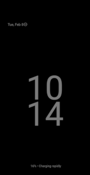

# Doze

Always-on Display (AOD) provides an alternative 'screen-off' experience. Instead, of completely turning the display off, it provides a distraction-free, glanceable experience for the phone in a low-powered mode. In this low-powered mode, the display will have a lower refresh rate and the UI should frequently shift its displayed contents in order to prevent burn-in. The recommended max on-pixel-ratio (OPR) is 5% to reduce battery consumption.



The default doze component controls AOD and is specified by `config_dozeComponent` in the [framework config][1]. SystemUI provides a default Doze Component: [DozeService][2]. [DozeService][2] builds a [DozeMachine][3] with dependencies specified in [DozeModule][4] and configurations in [AmbientDisplayConfiguration][13] and [DozeParameters][14].

Note: The default UI used in AOD shares views with the Lock Screen and does not create its own new views. Once dozing begins, [DozeUI][17] informs SystemUI's [DozeServiceHost][18] that dozing has begun - which sends this signal to relevant SystemUI Lock Screen views to animate accordingly. Within SystemUI, [StatusBarStateController][19] #isDozing and #getDozeAmount can be used to query dozing state.
[DozeMachine][3] handles the following main states:
* AOD - persistently showing UI when the device is in a low-powered state
* Pulsing - waking up the screen to show notifications (from AOD and screen off)
* Docked UI - UI to show when the device is docked
* Wake-up gestures - including lift to wake and tap to wake (from AOD and screen off)

## Doze States ([see DozeMachine.State][3])
### DOZE
Device is asleep and listening for enabled pulsing and wake-up gesture triggers. In this state, no UI shows.

### DOZE_AOD
Device is asleep, showing UI, and listening for enabled pulsing and wake-up triggers. In this state, screen brightness is handled by [DozeScreenBrightness][5] which uses the brightness sensor specified by `doze_brightness_sensor_type` in the [SystemUI config][6]. To save power, this should be a low-powered sensor that shouldn't trigger as often as the light sensor used for on-screen adaptive brightness.

### DOZE_AOD_PAUSED
Device is asleep and would normally be in state `DOZE_AOD`; however, instead the display is temporarily off since the proximity sensor reported near for a minimum abount of time. [DozePauser][7] handles transitioning from `DOZE_AOD_PAUSING` after the minimum timeout after the NEAR is reported by the proximity sensor from [DozeTriggers][8]).

### DOZE_PULSING
Device is awake and showing UI. This is state typically occurs in response to incoming notification, but may also be from other pulse triggers specified in [DozeTriggers][8].

### DOZE_AOD_DOCKED
Device is awake, showing docking UI and listening for enabled pulsing and wake-up triggers. The default DockManager is provided by an empty interface at [DockManagerImpl][9]. SystemUI should override the DockManager for the DozeService to handle docking events.

[DozeDockHandler][11] listens for Dock state changes from [DockManager][10] and updates the doze docking state.

## Wake-up gestures
Doze sensors are registered in [DozeTriggers][8] via [DozeSensors][12]. Sensors can be configured per posture for foldable devices.

Relevant sensors include:
* Proximity sensor
* Brightness sensor
* Wake-up gestures
  * tap to wake
  * double tap to wake
  * lift to wake
  * significant motion

And are configured in the [AmbientDisplayConfiguration][13] with some related configurations specified in [DozeParameters][14].

## Doze Suppressors
When Dozing is enabled, it can still be suppressed based on the device state. On a high-level, doze and/or AOD may be suppressed if the device is:
* in CAR_MODE
* not provisioned
* in power saver mode
* being suppressed by an app (see [PowerManager#suppressAmbientDisplay][16])

Refer to the documentation in [DozeSuppressors][15] for more information.

## AOD burn-in and image retention
Because AOD will show an image on the screen for an elogated period of time, AOD designs must take into consideration burn-in (leaving a permanent mark on the screen). Temporary burn-in is called image-retention.

To prevent burn-in, it is recommended to often shift UI on the screen. [DozeUi][17] schedules a call to dozeTimeTick every minute to request a shift in UI for all elements on AOD. The amount of shift can be determined by undergoing simulated AOD testing since this may vary depending on the display.

For manual local testing, set [DozeUI][17]#BURN_IN_TESTING_ENABLED to true, and then manual time broadcasts (ie: `adb shell 'date 022202222022.00 ; am broadcast -a android.intent.action.TIME_SET'`) will update the burn-in translations of the views. For a general idea where burn-in may be an issue, run the [software burn-in script][20].

## Debugging Tips
Enable DozeLog to print directly to logcat:
```
adb shell settings put global systemui/buffer/DozeLog v
```

Enable all DozeService logs to print directly to logcat:
```
adb shell setprop log.tag.DozeService DEBUG
```

Other helpful dumpsys commands (`adb shell dumpsys <service>`):
* activity service com.android.systemui/.doze.DozeService
* activity service com.android.systemui/.SystemUIService
* display
* power
* dreams
* sensorservice

[1]: /frameworks/base/core/res/res/values/config.xml
[2]: /frameworks/base/packages/SystemUI/src/com/android/systemui/doze/DozeService.java
[3]: /frameworks/base/packages/SystemUI/src/com/android/systemui/doze/DozeMachine.java
[4]: /frameworks/base/packages/SystemUI/src/com/android/systemui/doze/dagger/DozeModule.java
[5]: /frameworks/base/packages/SystemUI/src/com/android/systemui/doze/DozeScreenBrightness.java
[6]: /frameworks/base/packages/SystemUI/res/values/config.xml
[7]: /frameworks/base/packages/SystemUI/src/com/android/systemui/doze/DozePauser.java
[8]: /frameworks/base/packages/SystemUI/src/com/android/systemui/doze/DozeTriggers.java
[9]: /frameworks/base/packages/SystemUI/src/com/android/systemui/dock/DockManagerImpl.java
[10]: /frameworks/base/packages/SystemUI/src/com/android/systemui/dock/DockManager.java
[11]: /frameworks/base/packages/SystemUI/src/com/android/systemui/doze/DozeDockHandler.java
[12]: /frameworks/base/packages/SystemUI/src/com/android/systemui/doze/DozeSensors.java
[13]: /frameworks/base/core/java/android/hardware/display/AmbientDisplayConfiguration.java
[14]: /frameworks/base/packages/SystemUI/src/com/android/systemui/statusbar/phone/DozeParameters.java
[15]: /frameworks/base/packages/SystemUI/src/com/android/systemui/doze/DozeSuppressor.java
[16]: /frameworks/base/core/java/android/os/PowerManager.java
[17]: /frameworks/base/packages/SystemUI/src/com/android/systemui/doze/DozeUi.java
[18]: /frameworks/base/packages/SystemUI/src/com/android/systemui/statusbar/phone/DozeServiceHost.java
[19]: /frameworks/base/packages/SystemUI/plugin/src/com/android/systemui/plugins/statusbar/StatusBarStateController.java
[20]: /frameworks/base/packages/SystemUI/docs/clock-plugins.md
