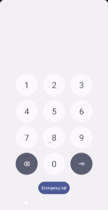
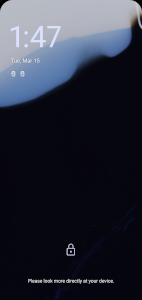

# Device Entry Glossary

## Keyguard

| Term                                                               | Description                                                                                                                                                                                                                                                                                                                                                                                                                                                                                                                                                                                                                                                                                                                                                                                                                                                                                                                                                                                                                                                                                                                                                                                                                                                                                                                                       |
|--------------------------------------------------------------------|---------------------------------------------------------------------------------------------------------------------------------------------------------------------------------------------------------------------------------------------------------------------------------------------------------------------------------------------------------------------------------------------------------------------------------------------------------------------------------------------------------------------------------------------------------------------------------------------------------------------------------------------------------------------------------------------------------------------------------------------------------------------------------------------------------------------------------------------------------------------------------------------------------------------------------------------------------------------------------------------------------------------------------------------------------------------------------------------------------------------------------------------------------------------------------------------------------------------------------------------------------------------------------------------------------------------------------------------------|
| Keyguard, [keyguard.md][1]                                         | Coordinates the first experience when turning on the display of a device, as long as the user has not specified a security method of NONE. Consists of the lock screen and bouncer.                                                                                                                                                                                                                                                                                                                                                                                                                                                                                                                                                                                                                                                                                                                                                                                                                                                                                                                                                                                                                                                                                                                                                               |
| Lock screen                    | The first screen available when turning on the display of a device, as long as the user has not specified a security method of NONE. On the lock screen, users can access:<ul><li>Quick Settings - users can swipe down from the top of the screen to interact with quick settings tiles</li><li>[Keyguard Status Bar][9] - This special status bar shows SIM related information and system icons.</li><li>Clock - uses the font specified at [clock.xml][8]. If the clock font supports variable weights, users will experience delightful clock weight animations - in particular, on transitions between the lock screen and AOD.</li><li>Notifications - ability to view and interact with notifications depending on user lock screen notification settings: `Settings > Display > Lock screen > Privacy`</li><li>Message area - contains device information like biometric errors, charging information and device policy information. Also includes user configured information from `Settings > Display > Lock screen > Add text on lock screen`. </li><li>Bouncer - if the user has a primary authentication method, they can swipe up from the bottom of the screen to bring up the bouncer.</li></ul>The lock screen is one state of the notification shade. See [StatusBarState#KEYGUARD][10] and [StatusBarState#SHADE_LOCKED][10]. |
| Bouncer, [bouncer.md][2]      | The component responsible for displaying the primary security method set by the user (password, PIN, pattern).  The bouncer can also show SIM-related security methods, allowing the user to unlock the device or SIM.                                                                                                                                                                                                                                                                                                                                                                                                                                                                                                                                                                                                                                                                                                                                                                                                                                                                                                                                                                                                                                                                                                                            |
| Split shade                                                        | State of the shade (which keyguard is a part of) in which notifications are on the right side and Quick Settings on the left. For keyguard that means notifications being on the right side and clock with media being on the left.  Split shade is automatically activated - using resources - for big screens in landscape, see [sw600dp-land/config.xml][3] `config_use_split_notification_shade`.  In that state we can see the big clock more often - every time when media is not visible on the lock screen. When there is no media and no notifications - or we enter AOD - big clock is always positioned in the center of the screen.  The magic of positioning views happens by changing constraints of [NotificationsQuickSettingsContainer][4] and positioning elements vertically in [KeyguardClockPositionAlgorithm][5]                                                                                                                                                                                                                                                                                                                                                                                                                                                                                          |
| Ambient display (AOD), [doze.md][6]   | UI shown when the device is in a low-powered display state. This is controlled by the doze component. The same lock screen views (ie: clock, notification shade) are used on AOD. The AOSP image on the left shows the usage of a clock that does not support variable weights which is why the clock is thicker in that image than what users see on Pixel devices.                                                                                                                                                                                                                                                                                                                                                                                                                                                                                                                                                                                                                                                                                                                                                                                                                                                                                                                                                                              |

## General Authentication Terms
| Term                     | Description                                                                                                                                   |
|--------------------------|-----------------------------------------------------------------------------------------------------------------------------------------------|
| Primary Authentication   | The strongest form of authentication. Includes: Pin, pattern and password input.                                                              |
| Biometric Authentication | Face or fingerprint input. Biometric authentication is categorized into different classes of security. See [Measuring Biometric Security][7]. |

## Face Authentication Terms
| Term                                                      | Description                                                                                                                                                                                                                                                                                                                                                                                                                                                                                                                                                                                                                                                                                                                                                                                               |
|-----------------------------------------------------------|-----------------------------------------------------------------------------------------------------------------------------------------------------------------------------------------------------------------------------------------------------------------------------------------------------------------------------------------------------------------------------------------------------------------------------------------------------------------------------------------------------------------------------------------------------------------------------------------------------------------------------------------------------------------------------------------------------------------------------------------------------------------------------------------------------------|
| Passive Authentication                                    | When a user hasn't explicitly requested an authentication method; however, it may still put the device in an unlocked state.  For example, face authentication is triggered immediately when waking the device; however, users may not have the intent of unlocking their device. Instead, they could have wanted to just check the lock screen. Because of this, SystemUI provides the option for a bypass OR non-bypass face authentication experience which have different user flows.  In contrast, fingerprint authentication is considered an active authentication method since users need to actively put their finger on the fingerprint sensor to authenticate. Therefore, it's an explicit request for authentication and SystemUI knows the user has the intent for device-entry. |
| Bypass                                                    | Used to refer to the face authentication bypass device entry experience. We have this distinction because face auth is a passive authentication method (see above).                                                                                                                                                                                                                                                                                                                                                                                                                                                                                                                                                                                                                                       |
| Bypass User Journey    | Once the user successfully authenticates with face, the keyguard immediately dismisses and the user is brought to the home screen/last app.  This CUJ prioritizes speed of device entry. SystemUI hides interactive views (notifications) on the lock screen to avoid putting users in a state where the lock screen could immediately disappear while they're interacting with affordances on the lock screen.                                                                                                                                                                                                                                                                                                                                                                                           |
| Non-bypass User Journey                                   | Once the user successfully authenticates with face, the device remains on keyguard until the user performs an action to indicate they'd like to enter the device (ie: swipe up on the lock screen or long press on the unlocked icon). This CUJ prioritizes notification visibility.                                                                                                                                                                                                                                                                                                                                                                                                                                                                                                                      |

## Fingerprint Authentication Terms
| Term                                     | Description                                                                                                                                                                                                                                                                                                                                                                                                                                                                                                                                                                                                                                                                                                                                                                                                                                                                                                                                 |
|------------------------------------------|---------------------------------------------------------------------------------------------------------------------------------------------------------------------------------------------------------------------------------------------------------------------------------------------------------------------------------------------------------------------------------------------------------------------------------------------------------------------------------------------------------------------------------------------------------------------------------------------------------------------------------------------------------------------------------------------------------------------------------------------------------------------------------------------------------------------------------------------------------------------------------------------------------------------------------------------|
| Under-display fingerprint sensor (UDFPS) | References the HW affordance for a fingerprint sensor that is under the display, which requires a software visual affordance. System UI supports showing the UDFPS affordance on the lock screen and on AOD. Users cannot authenticate from the screen-off state.  Supported SystemUI CUJs include:<ul><li> sliding finger on the screen to the UDFPS area to being authentication (as opposed to directly placing finger in the UDFPS area) </li><li> when a11y services are enabled, there is a haptic played when a touch is detected on UDFPS</li><li>after multiple consecutive hard-fingerprint-failures, the primary authentication bouncer is shown. The exact number of attempts is defined in: [BiometricUnlockController#UDFPS_ATTEMPTS_BEFORE_SHOW_BOUNCER][4]</li><li> when tapping on an affordance that requests to dismiss the lock screen, the user may see the UDFPS icon highlighted - see UDFPS bouncer</li></ul> |
| UDFPS Bouncer                            | UI that highlights the UDFPS sensor. Users can get into this state after tapping on a notification from the lock screen or locked expanded shade.                                                                                                                                                                                                                                                                                                                                                                                                                                                                                                                                                                                                                                                                                                                                                                                           |

## Other Authentication Terms
| Term         | Description                                                           |
|--------------|-----------------------------------------------------------------------|
| Trust Agents | Provides signals to the keyguard to allow it to lock less frequently. |

[1]: /frameworks/base/packages/SystemUI/docs/device-entry/keyguard.md
[2]: /frameworks/base/packages/SystemUI/docs/device-entry/bouncer.md
[3]: /frameworks/base/packages/SystemUI/res/values-sw600dp-land/config.xml
[4]: /frameworks/base/packages/SystemUI/src/com/android/systemui/statusbar/phone/NotificationsQuickSettingsContainer.java
[5]: /frameworks/base/packages/SystemUI/src/com/android/systemui/statusbar/phone/KeyguardClockPositionAlgorithm.java
[6]: /frameworks/base/packages/SystemUI/docs/device-entry/doze.md
[7]: https://source.android.com/security/biometric/measure
[8]: /frameworks/base/packages/SystemUI/res-keyguard/font/clock.xml
[9]: /frameworks/base/packages/SystemUI/src/com/android/systemui/statusbar/phone/KeyguardStatusBarViewController.java
[10]: /frameworks/base/packages/SystemUI/src/com/android/systemui/statusbar/StatusBarState.java
[11]: /frameworks/base/packages/SystemUI/src/com/android/systemui/statusbar/phone/BiometricUnlockController.java
