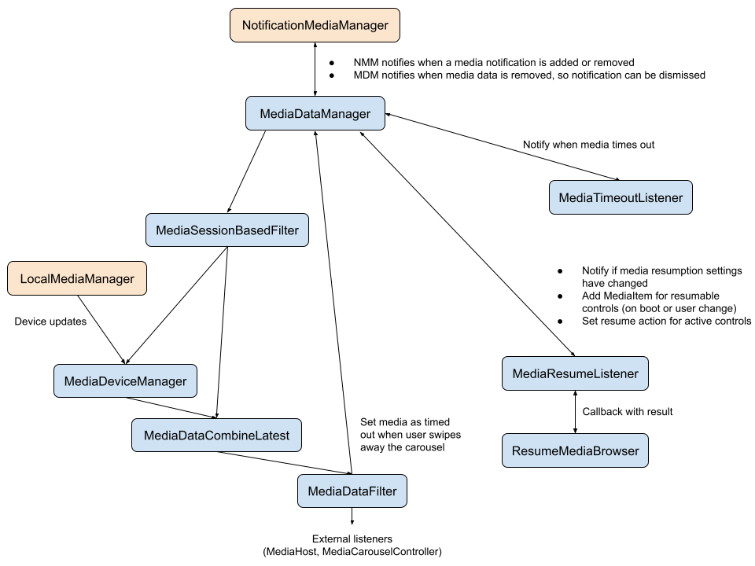

# SysUI Media Controls Pipeline

[TOC]

## Purpose

Describe how events flow through the media controls pipeline, and provide a high level overview of what the different components do.

## Pipeline Diagram

* Orange: External inputs
* Blue: Internal listeners; all except `MediaDataManager` and `ResumeMediaBrowser` implement [`MediaDataManager.Listener`](/packages/SystemUI/src/com/android/systemui/media/MediaDataManager.kt#711) and receive `onMediaDataLoaded` and `onMediaDataRemoved` events

## Classes

Files under [`systemui/media/`](/packages/SystemUI/src/com/android/systemui/media/):

* UI
   * `dialog/`
      * Output switcher dialog (maintained by Settings team)
   * IlluminationDrawable.kt
   * LightSourceDrawable.kt
      * These create the glow animation when you tap on a button (see [`qs_media_light_source`](/packages/SystemUI/res/drawable/qs_media_light_source.xml)). Should be reusable in other layouts.
   * Carousel:
      * MediaCarouselController.kt
         * Keeps the carousel view up to date and handles state changes (e.g. expansion)
         * Handles settings gear and page indicator
      * MediaCarouselScrollHandler.kt
         * Handles scrolling between players in the carousel
      * MediaScrollView.kt
         * Scrollview used in the carousel layout, has some custom measurement code
   * Individual players:
      * KeyguardMediaController.kt
         * Lockscreen media controls have a special wrapper in order to work with the existing lockscreen notification layout
      * MediaControlPanel.java
         * Main class for media control UI
      * SeekBarObserver.kt
         * Updates seekbar state
      * SeekBarViewModel.kt
         * Implements its own `computePosition()` for the seekbar (to avoid continually polling the `PlaybackState`, which involves binder calls)
         * Does some touch falsing (ignore flings, require drags to start near the thumb - otherwise users would often accidentally trigger the seekbar when they meant to move the carousel or shade)
      * MediaViewHolder.kt
         * Holds references to the UI elements in the panel
* Animation support:
   * MediaHierarchyManager.kt
      * Responsible for placement of media view and animation between hosts
   * MediaHost.kt
      * Every location that a media player could be located needs a `MediaHost`
      * Tracks configuration (if it should show inactive media, needs falsing, etc.)
   * MediaHostStatesManager.kt
      * Manages the various media host states and coordinates heights between different players
      * Has the most up to date state for any location
   * MediaViewController.kt
      * Controls a single instance of a media player, keeps the media view states up to date
* Backend
   * MediaData.kt
      * Holds all the media data (track info, active/resume state, etc.)
   * MediaDataCombineLatest.kt
      * Combines update events from `MediaDataManager` and `MediaDeviceManager`, so that downstream listeners will have device info
   * MediaDataFilter.kt
      * Filters media data based on the current user
      * Exit point for the pipeline: "external listeners" (currently `MediaHost` and `MediaCarouselController`), while they should be added via `MediaDataManager.addListener()`, will actually be listening to this output
   * MediaDataManager.kt
      * Entry point for the pipeline; initializes listener connections and assigns external listeners to the correct exit point
      * Converts media notifications and resumable media info into `MediaData`
   * MediaDeviceManager.kt
      * Handles device updates
   * MediaFeatureFlag.kt
      * Utility to check whether media controls are enabled
   * MediaSessionBasedFilter.kt
      * Filters media events based on media session. This prevents duplicate controls in situations like casting where we might get both a local and remote object for the same media session.
   * MediaTimeoutListener.kt
      * Listens to `PlaybackState` and marks controls inactive after the media has been paused/stopped for 10 minutes (value can be adjusted locally with `adb shell setprop debug.sysui.media_timeout [ms]`)
   * MediaResumeListener.kt
      * Listens for new media data and attempts to find a valid `MediaBrowserService` for the app. If successful, sends the information back to the `MediaDataManager`
      * Saves up to 5 valid `MediaBrowserService` components found this way, and queries them for recent media on boot or user change
      * Note: the user can disable this feature completely (or block certain apps from being resumable) in [Settings](https://source.corp.google.com/android/packages/apps/Settings/src/com/android/settings/sound/ResumableMediaAppsController.java), in which case this listener will do nothing (or ignore updates from the blocked apps).
   * ResumeMediaBrowser.java
      * Connects to an app's [`MediaBrowser`](https://developer.android.com/reference/android/media/browse/MediaBrowser) to determine whether SystemUI is able to connect and find a recent [`MediaItem`](https://developer.android.com/reference/android/media/browse/MediaBrowser.MediaItem)
* Factory classes (for unit testing):
   * LocalMediaManagerFactory.kt
   * MediaBrowserFactory.java
   * MediaControllerFactory.java
   * ResumeMediaBrowserFactory.java

## Miscellaneous

Other useful documents:

* [go/sysui-media-resumption-requirements](https://goto.google.com/sysui-media-resumption-requirements) - Internal documentation for app developers about how to work with media resumption
* [Playing nicely with media controls](https://android-developers.googleblog.com/2020/08/playing-nicely-with-media-controls.html) - blog post on the Android 11 updates
* [Media Controls developer guide](https://developer.android.com/guide/topics/media/media-controls)
