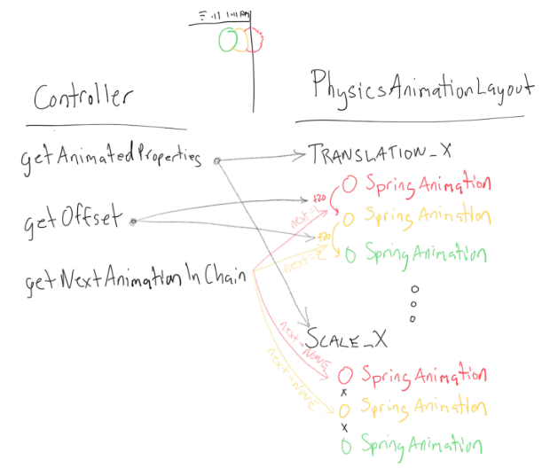
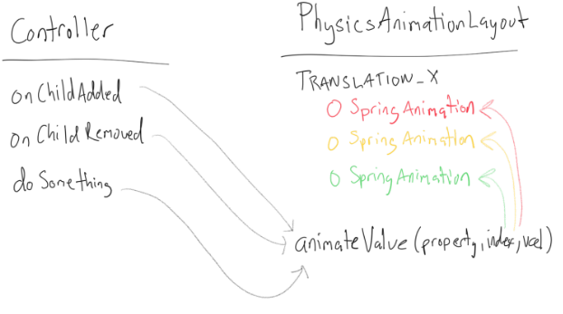

# Physics Animation Layout

## Overview
**PhysicsAnimationLayout** works with an implementation of **PhysicsAnimationController** to construct and maintain physics animations for each of its child views. During the initial construction of the animations, the layout queries the controller for configuration settings such as which properties to animate, which animations to chain together, and what stiffness or bounciness to use. Once the animations are built to the controller’s specifications, the controller can then ask the layout to start, stop and manipulate them arbitrarily to achieve any desired animation effect. The controller is notified whenever children are added or removed from the layout, so that it can animate their entrance or exit, respectively.

An example usage is Bubbles, which uses a PhysicsAnimationLayout for its stack of bubbles. Bubbles has controller subclasses including StackAnimationController and ExpansionAnimationController. StackAnimationController tells the layout to configure the translation animations to be chained (for the ‘following’ drag effect), and has methods such as ```moveStack(x, y)``` to animate the stack to a given point. ExpansionAnimationController asks for no animations to be chained, and exposes methods like ```expandStack()``` and ```collapseStack()```, which animate the bubbles to positions along the bottom of the screen.

## PhysicsAnimationController
PhysicsAnimationController is a public abstract class in PhysicsAnimationLayout. Controller instances must override configuration methods, which are used by the layout while constructing the animations, and animation control methods, which are called to initiate animations in response to events.

### Configuration Methods

The controller must override the following methods:

```Set<ViewProperty> getAnimatedProperties()```
Returns the properties, such as TRANSLATION_X and TRANSLATION_Y, for which the layout should construct physics animations.

```int getNextAnimationInChain(ViewProperty property, int index)```
If the animation at the given index should update another animation whenever its value changes, return the index of the other animation. Otherwise, return NONE. This is used to chain animations together, so that when one animation moves, the other ‘follows’ closely behind.

```float getOffsetForChainedPropertyAnimation(ViewProperty property)```
Value to add every time chained animations update the subsequent animation in the chain. For example, returning TRANSLATION_X offset = 20px means that if the first animation in the chain is animated to 10px, the second will update to 30px, the third to 50px, etc.

```SpringForce getSpringForce(ViewProperty property)```
Returns a SpringForce instance to use for animations of the given property. This allows the controller to configure stiffness and bounciness values. Since the physics animations internally use SpringForce instances to hold inflight animation values, this method needs to return a new SpringForce instance each time - no constants allowed.

### Animation Control Methods

Once the layout has used the controller’s configuration properties to build the animations, the controller can use them to actually run animations. This is done for two reasons - reacting to a view being added or removed, or responding to another class (such as a touch handler or broadcast receiver) requesting an animation. ```onChildAdded```, ```onChildRemoved```, and ```setChildVisibility``` are called automatically by the layout, giving the controller the opportunity to animate the child in/out/visible/gone. Custom methods are called by anyone with access to the controller instance to do things like expand, collapse, or move the child views.

In either case, the controller has access to the layout’s protected ```animateValueForChildAtIndex(ViewProperty property, int index, float value)``` method. This method is used to actually run an animation.

For example, moving the first child view to *(100, 200)*:

```
animateValueForChildAtIndex(TRANSLATION_X, 0, 100);
animateValueForChildAtIndex(TRANSLATION_Y, 0, 200);
```

This would use the physics animations constructed by the layout to spring the view to *(100, 200)*.

If the controller’s ```getNextAnimationInChain``` method set up the first child’s TRANSLATION_X/Y animations to be chained to the second child’s, this would result in the second child also springing towards (100, 200), plus any offset returned by ```getOffsetForChainedPropertyAnimation```.

## PhysicsAnimationLayout
The layout itself is a FrameLayout descendant with a few extra methods:

```setController(PhysicsAnimationController controller)```
Attaches the layout to the controller, so that the controller can access the layout’s protected methods. It also constructs or reconfigures the physics animations according to the new controller’s configuration methods.

```setEndListenerForProperty(ViewProperty property, AnimationEndListener endListener)```
Sets an end listener that is called when all animations on the given property have ended.

```setMaxRenderedChildren(int max)```
Child views beyond this limit will be set to GONE, and won't be animated, for performance reasons. Defaults to **5**.

It has one protected method, ```animateValueForChildAtIndex(ViewProperty property, int index, float value)```, which is visible to PhysicsAnimationController descendants. This method dispatches the given value to the appropriate animation.