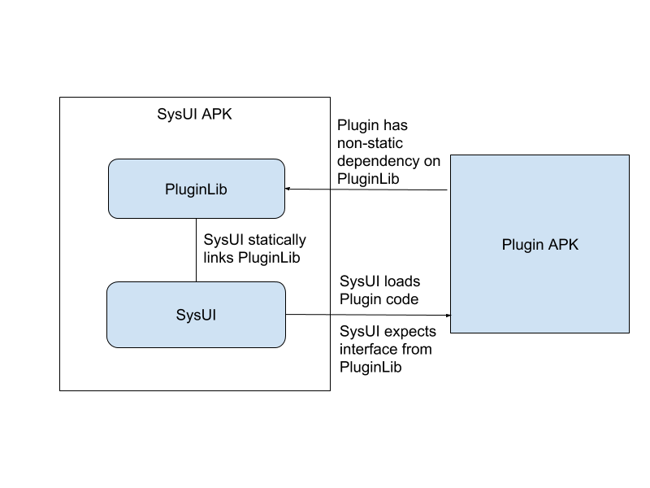

# SystemUI Plugins

Plugins provide an easy way to rapidly prototype SystemUI features.  Plugins are APKs that will be installable only on Build.IS_DEBUGGABLE (dogfood) builds, that can change the behavior of SystemUI at runtime.  This is done by creating a basic set of interfaces that the plugins can expect to be in SysUI, then the portion of code controlled by the interface can be iterated on faster than currently.

Plugins keep the experimental and turbulent code outside of master and only on the devices which need to use the prototype.  You can distribute early prototype directly to those that need to see it either through drive or email, and only show it to dogfooders when ready.

## Adding Plugin Hooks

Existing plugin hooks can be found [here](/packages/SystemUI/docs/plugin_hooks.md).

### Writing the Interface(s)

The first step of adding a plugin hook to SysUI is to define the interface layer between the plugin and SysUI.  This interface should be relatively stable so that many different plugins will work across multiple different builds.

All interfaces need to be independent and not reference classes from SysUI.  They should be placed in the plugin library, under com.android.systemui.plugin or sub-packages.  The main interface (entry point) for the plugin should extend the interface Plugin so that you can listen for it.


The most important part of interfaces is the version included in them.  Every time the interface changes in an incompatible way, the version should be incremented.  Incompatible changes are changes to the signature of any of the interface methods, or the addition of a new method that doesn’t have a default implementation.  All classes that are in the plugin library should be tagged with a version, they should also be tagged with an action if they are the root interface for the Plugin. If a plugin makes use of the other versioned interface, they can use DependsOn to indicate their dependence. They are tagged using annotations like the following.


```java
@ProvidesInterface(action = MyPlugin.ACTION, version = MyPlugin.VERSION)
@DependsOn(target = OtherInterface.class)
public interface MyPlugin extends Plugin {
    String ACTION = "com.android.systemui.action.PLUGIN_MY_PLUGIN";
    int VERSION = 1;
    ...
}
```

### Plugin Listener

To actually listen for plugins, you implement a plugin listener that has the following interface.

```java
public interface PluginListener<T extends Plugin> {
    /**
     * Called when the plugin has been loaded and is ready to be used.
     * This may be called multiple times if multiple plugins are allowed.
     * It may also be called in the future if the plugin package changes
     * and needs to be reloaded.
     */
    void onPluginConnected(T plugin);

    /**
     * Called when a plugin has been uninstalled/updated and should be removed
     * from use.
     */
    default void onPluginDisconnected(T plugin) {
        // Optional.
    }
}
```

Then you register the PluginListener with the PluginManager.  The constants for action and version should be defined on class T.  If allowMultiple is false, the plugin listener will only be connected to one plugin at a time.

```java
void addPluginListener(String action, PluginListener<T> listener,
            int version, boolean allowMultiple);
```

### Examples
[Allow quick settings panel to be replaced with another view](/packages/SystemUI/plugin/src/com/android/systemui/plugins/qs/QS.java)

[Allow plugins to create new nav bar buttons](/packages/SystemUI/plugin/src/com/android/systemui/plugins/statusbar/phone/NavBarButtonProvider.java)

[Allow lockscreen camera/phone/assistant buttons to be replaced](/packages/SystemUI/plugin/src/com/android/systemui/plugins/IntentButtonProvider.java)

## Writing Plugins
### Make Files and Manifests

When compiling plugins there are a couple vital pieces required.
1. They must be signed with the platform cert
2. They must include SystemUIPluginLib in LOCAL_JAVA_LIBRARIES (NOT LOCAL_STATIC_JAVA_LIBRARIES)

Basically just copy the [example blueprint file](/packages/SystemUI/plugin/ExamplePlugin/Android.bp).

To declare a plugin, you add a service to your manifest.  Add an intent filter to match the action for the plugin, and set the name to point at the class that implements the plugin interface.

```xml
       <service android:name=".SampleOverlayPlugin"
            android:label="@string/plugin_label">
            <intent-filter>
                <action android:name="com.android.systemui.action.PLUGIN_OVERLAY" />
            </intent-filter>
        </service>
```

Plugins must also hold the plugin permission.

```xml
   <uses-permission android:name="com.android.systemui.permission.PLUGIN" />
 ```


### Implementing the interface

Implementing the interface is generally pretty straightforward.  The version of the plugin should tagged with an annotation to declare its dependency on each of the plugin classes it depends on.  This ensures that the latest version will be included in the plugin APK when it is compiled.

```java
@Requires(target = OverlayPlugin.class, version = OverlayPlugin.VERSION)
public class SampleOverlayPlugin implements OverlayPlugin {
    ...
}
```

After the plugin is created and passes all permission/security checks, then the plugin will receive the onCreate callback.  The pluginContext is pregenerated for the plugin and can be used to inflate or get any resources included in the plugin APK.

```java
public void onCreate(Context sysuiContext, Context pluginContext);
```

When the plugin is being removed, the plugin will receive the onDestroy callback.  At this point the plugin should ensure that all its resources and static references are cleaned up.

```java
public void onDestroy();
```

### Adding Settings

A plugin can provide plugin-specific settings that will be surfaced as a gear button on the plugin tuner screen where plugins can be enabled or disabled.  To add settings just add an activity to receive the PLUGIN_SETTINGS action.

```xml
        <activity android:name=".PluginSettings"
            android:label="@string/plugin_label">
            <intent-filter>
                <action android:name="com.android.systemui.action.PLUGIN_SETTINGS" />
            </intent-filter>
        </activity>
 ```

The plugin settings activity does not run in SysUI like the rest of the plugin, so it cannot reference any of the classes from SystemUIPluginLib.

## Examples
[The definitive ExamplePlugin](/packages/SystemUI/plugin/ExamplePlugin)

[Replace lock screen camera button with a settings trigger](todo)

[A nav button that launches an action](todo)


## Writing plugins in Android Studio

As long as the plugin doesn’t depend on any hidden APIs (which plugins should avoid anyway) and only uses Plugin APIs, you can be setup to build in android studio with only a couple steps.

### Signing

Plugins need to be signed with the platform cert, so you’ll need a copy of the keystore that contains the same cert.  You might find one at http://go/plugin-keystore, you can copy it to the root directory of your project.  Then you can tell your module to be signed with it by adding the following to the android section of your module’s build.gradle.

```groovy
android {
    ...
    buildTypes {
        release {
            minifyEnabled false
            proguardFiles getDefaultProguardFile('proguard-android.txt'), 'proguard-rules.pro'
        }
        debug {
            signingConfig signingConfigs.debug
        }
     }
     signingConfigs {
        debug {
            keyAlias 'platform'
            keyPassword 'android'
            storeFile file('../platform.keystore')
            storePassword 'android'
        }
     }
   ...
}
```


### Compiling against Plugin APIs

To be able to implement a plugin, you’ll need a jar file that contains the plugin classes for compilation.  Generally you can grab a recent plugin lib from jmonk’s experimental directory.  However if you recently changed one of the plugin interfaces, you might want to build an updated version, you can use the following script to do so.

```
$ frameworks/base/packages/SystemUI/plugin/update_plugin_lib.sh
```

Once you have the jar you are going to compile against, you need to include it in your android studio project as a file dependency.  Once it is included change its scope from Compile to Provided in the project structure (you may need to build once before changing to provided).  This is required to ensure you don’t actually include the plugin library in your plugin APK.

## Implementation Details

Plugins are APKs that contain code and resources that can be dynamically loaded into SystemUI.  The plugins are compiled against a set of relatively stable (and version tagged) interfaces, that the implementations are provided by SysUI.  This figure shows an overview of how the plugin compiling/loading flow works.



### Security

Whenever loading a code from another APK into a privileged process like SysUI, there are serious security concerns to be addressed.  To handle this, plugins have a couple lines of defense to ensure these don’t create any security holes.

The first line of defense is Build.IS_DEBUGGABLE checks.  In 2 different places, SysUI checks to ensure that the build is debuggable before even scanning or loading any plugins on the device.  There are even tests in place to help ensure these checks are not lost.

The second line of defense is a signature permission.  This ensures that plugins are always provided by the source of the android build.  All plugins must hold this permission for any of their code to be loaded, otherwise the infraction will be logged, and the plugin ignored.

```xml
   <permission android:name="com.android.systemui.permission.PLUGIN"
            android:protectionLevel="signature" />
 ```

### Plugin Management

Plugins are scanned for by intent filters of services.  A plugin is not actually a service, but the benefits of declaring it as a service makes it worth it.  Each plugin listener in SysUI simply specifies an action to look for, and the PluginManager scans for services declaring that action and uses that to know the class to instantiate.


The other major advantage to declaring plugins through components in a manifest is management of enabled state.  Whether a plugin is enabled or disabled is managed by the package manager component enabled state.  When a device has had a plugin installed on it, an extra section is added to the SystemUI Tuner, it lists all of the plugins on the device and allows the components to be easily enabled and disabled.

### Versioning

When a plugin listener is registered in SysUI, the interface version is specified.  Whenever a plugin is detected, the first thing that is done after instantiation is the version is checked.  If the version of the interface the plugin was compiled with does not match the version SysUI contains, then the plugin will be ignored.

### Class loading

When plugins are loaded, they are done so by creating a PathClassLoader that points at the plugin APK.  The parent of the classloader is a special classloader based on SysUI’s that only includes the classes within the package com.android.systemui.plugin and its sub-packages.

Having SysUI provide the implementations of the interfaces allows them to be more stable.  Some version changes can be avoided by adding defaults to the interfaces, and not requiring older plugins to implement new functionality.  The plugin library can also have static utility methods that plugins compile against, but the implementations are in sync with the platform builds.

The class filtering in the parent classloader allows plugins to include any classes they want without worrying about collisions with SysUI.  Plugins can include SettingsLib, or copy classes directly out of SysUI to facilitate faster prototyping.

### Crashing

Whether it be from accidental reference of hidden APIs, unstable prototypes, or other unexpected reasons, plugins will inevitably cause SysUI to crash.  When this happens it needs to ensure a bad acting plugin do not stop the phone from being usable.

When a plugin crashes, the PluginManager catches it and tries to determine the plugin that caused the crash.  If any of the classes in the stack trace are from the package of the plugin APK, then the plugin is disabled.  If no plugins can be identified as the source of the crash, then all plugins are disabled, just to be sure they aren’t causing future crashes.
