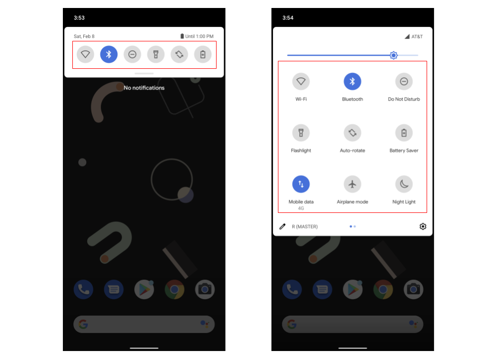

# Quick Settings Tiles (almost all there is to know about them)

[TOC]

## About this document

This document is a more or less comprehensive summary of the state and infrastructure used by Quick Settings tiles. It provides descriptions about the lifecycle of a tile, how to create new tiles and how SystemUI manages and displays tiles, among other topics.

## What are Quick Settings Tiles?

Quick Settings (from now on, QS) is the expanded panel that contains shortcuts for the user to toggle many settings. This is opened by expanding the notification drawer twice (or once when phone is locked). Quick Quick Settings (QQS) is the smaller panel that appears on top of the notifications before expanding twice and contains some of the toggles with no secondary line.

Each of these toggles that appear either in QS or QQS are called Quick Settings Tiles (or tiles for short). They allow the user to enable or disable settings quickly and sometimes provides access to more comprehensive settings pages.

The following image shows QQS on the left and QS on the right, with the tiles highlighted.



QS Tiles usually depend on one or more Controllers that bind the tile with the necessary service. Controllers are obtained by the backend and used for communication between the user and the device. 

### A note on multi-user support

All the classes described in this document that live inside SystemUI are only instantiated in the process of user 0. The different controllers that back the QS Tiles (also instantiated just in user 0) are user aware and provide an illusion of different instances for different users.

For an example on this, see [`RotationLockController`](/packages/SystemUI/src/com/android/systemui/statusbar/policy/RotationLockControllerImpl.java). This controller for the `RotationLockTile` listens to changes in all users.

## What are tiles made of?

### Tile backend

QS Tiles are composed of the following backend classes.

* [`QSTile`](/packages/SystemUI/plugin/src/com/android/systemui/plugins/qs/QSTile.java): Interface providing common behavior for all Tiles. This class also contains some useful utility classes needed for the tiles.
  * `Icon`: Defines the basic interface for an icon as used by the tiles.
  * `State`: Encapsulates the state of the Tile in order to communicate between the backend and the UI.
* [`QSTileImpl`](/packages/SystemUI/src/com/android/systemui/qs/tileimpl/QSTileImpl.java): Abstract implementation of `QSTile`, providing basic common behavior for all tiles. Also implements extensions for different types of `Icon`. All tiles currently defined in SystemUI subclass from this implementation.
* [`SystemUI/src/com/android/systemui/qs/tiles`](/packages/SystemUI/src/com/android/systemui/qs/tiles): Each tile from SystemUI is defined here by a class that extends `QSTileImpl`. These implementations connect to corresponding controllers. The controllers serve two purposes:
    * track the state of the device and notify the tile when a change has occurred (for example, bluetooth connected to a device)
    * accept actions from the tiles to modify the state of the phone (for example, enablind and disabling wifi).
* [`CustomTile`](/packages/SystemUI/src/com/android/systemui/qs/external/CustomTile.java): Equivalent to the tiles in the previous item, but used for 3rd party tiles. In depth information to be found in [`CustomTile`](#customtile)

All the elements in SystemUI that work with tiles operate on `QSTile` or the interfaces defined in it. However, all the current implementations of tiles in SystemUI subclass from `QSTileImpl`, as it takes care of many common situations. Throughout this document, we will focus on `QSTileImpl` as examples of tiles.

The interfaces in `QSTile` as well as other interfaces described in this document can be used to implement plugins to add additional tiles or different behavior. For more information, see [plugins.md](plugins.md)

#### Tile State

Each tile has an associated `State` object that is used to communicate information to the corresponding view. The base class `State` has (among others) the following fields:

* **`state`**: one of `Tile#STATE_UNAVAILABLE`, `Tile#STATE_ACTIVE`, `Tile#STATE_INACTIVE`.
* **`icon`**; icon to display. It may depend on the current state.
* **`label`**: usually the name of the tile.
* **`secondaryLabel`**: text to display in a second line. Usually extra state information.
* **`contentDescription`**
* **`expandedAccessibilityClassName`**: usually `Switch.class.getName()` for boolean Tiles. This will make screen readers read the current state of the tile as well as the new state when it's toggled. For this, the Tile has to use `BooleanState`.
* **`handlesLongClick`**: whether the Tile will handle long click. If it won't, it should be set to `false` so it will not be announced for accessibility.

Setting any of these fields during `QSTileImpl#handleUpdateState` will update the UI after it.

Additionally. `BooleanState` has a `value` boolean field that usually would be set to `state == Tile#STATE_ACTIVE`. This is used by accessibility services along with `expandedAccessibilityClassName`.

#### SystemUI tiles

Each tile defined in SystemUI extends `QSTileImpl`. This abstract class implements some common functions and leaves others to be implemented by each tile, in particular those that determine how to handle different events (refresh, click, etc.).

For more information on how to implement a tile in SystemUI, see [Implementing a SystemUI tile](#implementing-a-systemui-tile).

### Tile views

Each Tile has a couple of associated views for displaying it in QS and QQS. These views are updated after the backend updates the `State` using `QSTileImpl#handleUpdateState`.

* **[`QSTileView`](/packages/SystemUI/plugin/src/com/android/systemui/plugins/qs/QSTileView.java)**: Abstract class that provides basic Tile functionality. These allows external [Factories](#qsfactory) to create Tiles.
* **[`QSTileViewImpl`](/packages/SystemUI/src/com/android/systemui/qs/tileimpl/QSTileViewImpl.java)**: Implementation of `QSTileView`. It takes care of the following:
  * Holding the icon
  * Background color and shape
  * Ripple
  * Click listening
  * Labels
* **[`QSIconView`](/packages/SystemUI/plugin/src/com/android/systemui/plugins/qs/QSIconView.java)**
* **[`QSIconViewImpl`](/packages/SystemUI/src/com/android/systemui/qs/tileimpl/QSIconViewImpl.java)**

#### QSIconView and QSIconViewImpl

`QSIconView` is an interface that define the basic actions that icons have to respond to. Its base implementation in SystemUI is `QSIconViewImpl` and it and its subclasses are used by all QS tiles.

This `ViewGroup` is a container for the icon used in each tile. It has methods to apply the current `State` of the tile, modifying the icon (color and animations). Classes that inherit from this can add other details that are modified when the `State` changes.

Each `QSTileImpl` can specify that they use a particular implementation of this class when creating an icon.

### How are the backend and the views related?

The backend of the tiles (all the implementations of `QSTileImpl`) communicate with the views by using a `State`. The backend populates the state, and then the view maps the state to a visual representation.

It's important to notice that the state of the tile (internal or visual) is not directly modified by a user action like clicking on the tile. Instead, acting on a tile produces internal state changes on the device, and those trigger the changes on the tile state and UI.

When a container for tiles (`QuickQSPanel` or `QSPanel`) has to display tiles, they create a [`TileRecord`](/packages/SystemUI/src/com/android/systemui/qs/QSPanel.java). This associates the corresponding `QSTile` with its `QSTileView`, doing the following:

* Create the corresponding `QSTileView` to display in that container.
* Create a callback for `QSTile` to call when its state changes. Note that a single tile will normally have up to two callbacks: one for QS and one for QQS.

#### Life of a tile click

This is a brief run-down of what happens when a user clicks on a tile. Internal changes on the device (for example, changes from Settings) will trigger this process starting in step 3. Throughout this section, we assume that we are dealing with a `QSTileImpl`.

1. User clicks on tile. The following calls happen in sequence:
   1. `QSTileViewImpl#onClickListener`.
   2. `QSTile#click`.
   3. `QSTileImpl#handleClick`. This last call sets the new state for the device by using the associated controller.
2. State in the device changes. This is normally outside of SystemUI's control.
3. Controller receives a callback (or `Intent`) indicating the change in the device. The following calls happen:
   1. `QSTileImpl#refreshState`, maybe passing an object with necessary information regarding the new state.
   2. `QSTileImpl#handleRefreshState`
4. `QSTileImpl#handleUpdateState` is called to update the state with the new information. This information can be obtained both from the `Object` passed to `refreshState` as well as from the controller.
5. If the state has changed (in at least one element), `QSTileImpl#handleStateChanged` is called. This will trigger a call to all the associated `QSTile.Callback#onStateChanged`, passing the new `State`.
6. `QSTileView#onStateChanged` is called and this calls `QSTileView#handleStateChanged`. This method maps the state into the view:
   * The tile colors change to match the new state.
   * `QSIconView.setIcon` is called to apply the correct state to the icon and the correct icon to the view.
   * The tile labels change to match the new state.

## Third party tiles (TileService)

A third party tile is any Quick Settings tile that is provided by an app (that's not SystemUI). This is implemented by developers subclassing [`TileService`](/core/java/android/service/quicksettings/TileService.java) and interacting with its API.

### API classes

The classes that define the public API are in [core/java/android/service/quicksettings](core/java/android/service/quicksettings).

#### Tile

Parcelable class used to communicate information about the state between the external app and SystemUI. The class supports the following fields:

* Label
* Subtitle
* Icon
* State (`Tile#STATE_ACTIVE`, `Tile#STATE_INACTIVE`, `Tile#STATE_UNAVAILABLE`)
* Content description

Additionally, it provides a method to notify SystemUI that the information may have changed and the tile should be refreshed.

#### TileService

This is an abstract Service that needs to be implemented by the developer. The Service manifest must have the permission `android.permission.BIND_QUICK_SETTINGS_TILE` and must respond to the action `android.service.quicksettings.action.QS_TILE`. This will allow SystemUI to find the available tiles and display them to the user.

The implementer is responsible for creating the methods that will respond to the following calls from SystemUI:

* **`onTileAdded`**: called when the tile is added to QS.
* **`onTileRemoved`**: called when the tile is removed from QS.
* **`onStartListening`**: called when QS is opened and the tile is showing. This marks the start of the window when calling `getQSTile` is safe and will provide the correct object.
* **`onStopListening`**: called when QS is closed or the tile is no longer visible by the user. This marks the end of the window described in `onStartListening`.
* **`onClick`**: called when the user clicks on the tile.

Additionally, the following final methods are provided:

* ```java
  public final Tile getQsTile()
  ```

  Provides the tile object that can be modified. This should only be called in the window between `onStartListening` and `onStopListening`.

* ```java
  public final boolean isLocked()

  public final boolean isSecure()
  ```

  Provide information about the secure state of the device. This can be used by the tile to accept or reject actions on the tile.

* ```java
  public final void unlockAndRun(Runnable)
  ```

  May prompt the user to unlock the device if locked. Once the device is unlocked, it runs the given `Runnable`.

* ```java
  public final void showDialog(Dialog)
  ```

  Shows the provided dialog.

##### Binding

When the Service is bound, a callback Binder is provided by SystemUI for all the callbacks, as well as an identifier token (`Binder`). This token is used in the callbacks to identify this `TileService` and match it to the corresponding tile.

The tiles are bound once immediately on creation. After that, the tile is bound whenever it should start listening. When the panels are closed, and the tile is set to stop listening, it will be unbound after a delay of `TileServiceManager#UNBIND_DELAY` (30s), if it's not set to listening again.

##### Active tile

A `TileService` can be declared as an active tile by adding specific meta-data to its manifest (see [TileService#META_DATA_ACTIVE_TILE](https://developer.android.com/reference/android/service/quicksettings/TileService#META_DATA_ACTIVE_TILE)). In this case, it won't receive a call of `onStartListening` when QS is opened. Instead, the tile must request listening status by making a call to `TileService#requestListeningState` with its component name. This will initiate a window that will last until the tile is updated.

The tile will also be granted listening status if it's clicked by the user.

### SystemUI classes

The following sections describe the classes that live in SystemUI to support third party tiles. These classes live in [SystemUI/src/com/android/systemui/qs/external](/packages/SystemUI/src/com/android/systemui/qs/external/)

#### CustomTile

This class is an subclass of `QSTileImpl` to be used with third party tiles. It provides similar behavior to SystemUI tiles as well as handling exclusive behavior like lifting default icons and labels from the application manifest.

#### TileServices

This class is the central controller for all tile services that are currently in Quick Settings as well as provides the support for starting new ones. It is also an implementation of the `Binder` that receives all calls from current `TileService` components and dispatches them to SystemUI or the corresponding `CustomTile`.

Whenever a binder call is made to this class, it matches the corresponding token assigned to the `TileService` with the `ComponentName` and verifies that the call comes from the right UID to prevent spoofing.

As this class is the only one that's aware of every `TileService` that's currently bound, it is also in charge of requesting some to be unbound whenever there is a low memory situation.

#### TileLifecycleManager

This class is in charge of binding and unbinding to a particular `TileService` when necessary, as well as sending the corresponding binder calls. It does not decide whether the tile should be bound or unbound, unless it's requested to process a message. It additionally handles errors in the `Binder` as well as changes in the corresponding component (like updates and enable/disable).

The class has a queue that stores requests while the service is not bound, to be processed as soon as the service is bound.

Each `TileService` gets assigned an exclusive `TileLifecycleManager` when its corresponding tile is added to the set of current ones and kept as long as the tile is available to the user.

#### TileServiceManager

Each instance of this class is an intermediary between the `TileServices` controller and a `TileLifecycleManager` corresponding to a particular `TileService`.

This class handles management of the service, including:

* Deciding when to bind and unbind, requesting it to the `TileLifecycleManager`.
* Relaying messages to the `TileService` through the `TileLifecycleManager`.
* Determining the service's bind priority (to deal with OOM situations).
* Detecting when the package/component has been removed in order to remove the tile and references to it.

## How are tiles created/instantiated?

This section describes the classes that aid in the creation of each tile as well as the complete lifecycle of a tile. First we describe two important interfaces/classes.

### QSTileHost

This class keeps track of the tiles selected by the current user (backed in the Secure Setting `sysui_qs_tiles`) to be displayed in Quick Settings. Whenever the value of this setting changes (or on device start), the whole list of tiles is read. This is compared with the current tiles, destroying unnecessary ones and creating needed ones.

It additionally provides a point of communication between the tiles and the StatusBar, for example to open it and collapse it. And a way for the StatusBar service to add tiles (only works for `CustomTile`).

#### Tile specs

Each single tile is identified by a spec, which is a unique String for that type of tile. The current tiles are stored as a Setting string of comma separated values of these specs. Additionally, the default tiles (that appear on a fresh system) configuration value is stored likewise.

SystemUI tile specs are usually a single simple word identifying the tile (like `wifi` or `battery`). Custom tile specs are always a string of the form `custom(...)` where the ellipsis is a flattened String representing the `ComponentName` for the corresponding `TileService`.

### QSFactory

This interface provides a way of creating tiles and views from a spec. It can be used in plugins to provide different definitions for tiles.

In SystemUI there is only one implementation of this factory and that is the default factory (`QSFactoryImpl`) in `QSTileHost`.

#### QSFactoryImpl

This class implements two methods as specified in the `QSFactory` interface:

* ```java
  public QSTile createTile(String)
  ```

  Creates a tile (backend) from a given spec. The factory has providers for all of the SystemUI tiles, returning one when the correct spec is used.

  If the spec is not recognized but it has the `custom(` prefix, the factory tries to create a `CustomTile` for the component in the spec. This could fail (the component is not a valid `TileService` or is not enabled) and will be detected later when the tile is polled to determine if it's available.

* ```java
  public QSTileView createTileView(QSTile, boolean)
  ```

  Creates a view for the corresponding `QSTile`. The second parameter determines if the view that is created should be a collapsed one (for using in QQS) or not (for using in QS).

### Lifecycle of a Tile

We describe first the parts of the lifecycle that are common to SystemUI tiles and third party tiles. Following that, there will be a section with the steps that are exclusive to third party tiles.

1. The tile is added through the QS customizer by the user. This will immediately save the new list of tile specs to the Secure Setting `sysui_qs_tiles`. This step could also happend if `StatusBar` adds tiles (either through adb, or through its service interface as with the `DevelopmentTiles`).
2. This triggers a "setting changed" that is caught by `QSTileHost`. This class processes the new value of the setting and finds out that there is a new spec in the list. Alternatively, when the device is booted, all tiles in the setting are considered as "new".
3. `QSTileHost` calls all the available `QSFactory` classes that it has registered in order to find the first one that will be able to create a tile with that spec. Assume that `QSFactoryImpl` managed to create the tile, which is some implementation of `QSTile` (either a SystemUI subclass of `QSTileImpl` or a `CustomTile`). If the tile is available, it's stored in a map and things proceed forward.
4. `QSTileHost` calls its callbacks indicating that the tiles have changed. In particular, `QSPanel` and `QuickQSPanel` receive this call with the full list of tiles. We will focus on these two classes.
5. For each tile in this list, a `QSTileView` is created (collapsed or expanded) and attached to a `TileRecord` containing the tile backend and the view. Additionally:
    * a callback is attached to the tile to communicate between the backend and the view or the panel.
    * the click listeners in the tile are attached to those of the view.
6. The tile view is added to the corresponding layout.

When the tile is removed from the list of current tiles, all these classes are properly disposed including removing the callbacks and making sure that the backends remove themselves from the controllers they were listening to.

#### Lifecycle of a CustomTile

In step 3 of the previous process, when a `CustomTile` is created, additional steps are taken to ensure the proper binding to the service as described in [Third party tiles (TileService)](#third-party-tiles-tileservice).

1. The `CustomTile` obtains the `TileServices` class from the `QSTileHost` and request the creation of a `TileServiceManager` with its token. As the spec for the `CustomTile` contains the `ComponentName` of the associated service, this can be used to bind to it.
2. The `TileServiceManager` creates its own `TileLifecycleManager` to take care of binding to the service.
3. `TileServices` creates maps between the token, the `CustomTile`, the `TileServiceManager`, the token and the `ComponentName`.

## Implementing a tile

This section describes necessary and recommended steps when implementing a Quick Settings tile. Some of them are optional and depend on the requirements of the tile.

### Implementing a SystemUI tile

1. Create a class (preferably in [`SystemUI/src/com/android/systemui/qs/tiles`](/packages/SystemUI/src/com/android/systemui/qs/tiles)) implementing `QSTileImpl` with a particular type of `State` as a parameter.
2. Create an injectable constructor taking a `QSHost` and whichever classes are needed for the tile's operation. Normally this would be other SystemUI controllers.
3. Implement the methods described in [Abstract methods in QSTileImpl](#abstract-methods-in-qstileimpl). Look at other tiles for help. Some considerations to have in mind:
    * If the tile will not support long click (like the `FlashlightTile`), set `state.handlesLongClick` to `false` (maybe in `newTileState`).
    * Changes to the tile state (either from controllers or from clicks) should call `refreshState`.
    * Use only `handleUpdateState` to modify the values of the state to the new ones. This can be done by polling controllers or through the `arg` parameter.
    * If the controller is not a `CallbackController`, respond to `handleSetListening` by attaching/dettaching from controllers.
    * Implement `isAvailable` so the tile will not be created when it's not necessary.
4. In `QSFactoryImpl`:
    * Inject a `Provider` for the tile created before.
    * Add a case to the `switch` with a unique String spec for the chosen tile.
5. In [SystemUI/res/values/config.xml](/packages/SystemUI/res/values/config.xml), modify `quick_settings_tiles_stock` and add the spec defined in the previous step. If necessary, add it also to `quick_settings_tiles_default`. The first one contains a list of all the tiles that SystemUI knows how to create (to show to the user in the customization screen). The second one contains only the default tiles that the user will experience on a fresh boot or after they reset their tiles.
6. In [SystemUI/res/values/tiles_states_strings.xml](/packages/SystemUI/res/values/tiles_states_strings.xml), add a new array for your tile. The name has to be `tile_states_<spec>`. Use a good description to help the translators.
7. In [`SystemUI/src/com/android/systemui/qs/tileimpl/QSTileViewImpl.kt`](/packages/SystemUI/src/com/android/systemui/qs/tileimpl/QSTileViewImpl.kt), add a new element to the map in `SubtitleArrayMapping` corresponding to the resource created in the previous step.

#### Abstract methods in QSTileImpl

Following are methods that need to be implemented when creating a new SystemUI tile. `TState` is a type variable of type `State`.

* ```java
    public TState newTileState()
  ```

    Creates a new `State` for this tile to use. Each time the state changes, it is copied into a new one and the corresponding fields are modified. The framework provides `State`, `BooleanState` (has an on and off state and provides this as a content description), `SignalState` (`BooleanState` with `activityIn` and `activityOut`), and `SlashState` (can be rotated or slashed through).

    If a tile has special behavior (no long click, no ripple), it can be set in its state here.

* ```java
    public void handleSetListening(boolean)
    ```

    Initiates or terminates listening behavior, like listening to Callbacks from controllers. This gets triggered when QS is expanded or collapsed (i.e., when the tile is visible and actionable). Most tiles (like `WifiTile`) do not implement this. Instead, Tiles are LifecycleOwner and are marked as `RESUMED` or `DESTROYED` in `QSTileImpl#handleListening` and handled as part of the lifecycle of [CallbackController](/packages/SystemUI/src/com/android/systemui/statusbar/policy/CallbackController.java)

* ```java
    public QSIconView createTileView(Context)
  ```

  Allows a Tile to use a `QSIconView` different from `QSIconViewImpl` (see [Tile views](#tile-views)), which is the default defined in `QSTileImpl`

* ```java
    public Intent getLongClickIntent()
  ```

  Determines the `Intent` launched when the Tile is long pressed.

* ```java
    protected void handleClick()

    protected void handleSecondaryClick()

    protected void handleLongClick()
  ```

  Handles what to do when the Tile is clicked. In general, a Tile will make calls to its controller here and maybe update its state immediately (by calling `QSTileImpl#refreshState`). A Tile can also decide to ignore the click here, if it's `Tile#STATE_UNAVAILABLE`.

  By default long click redirects to click and long click launches the intent defined in `getLongClickIntent`.

* ```java
    protected void handleUpdateState(TState, Object)
  ```

  Updates the `State` of the Tile based on the state of the device as provided by the respective controller. It will be called every time the Tile becomes visible, is interacted with or `QSTileImpl#refreshState` is called. After this is done, the updated state will be reflected in the UI.

* ```java
  public int getMetricsCategory()
  ```

  Identifier for this Tile, as defined in [proto/src/metrics_constants/metrics_constants.proto](/proto/src/metrics_constants/metrics_constants.proto). This is used to log events related to this Tile.

* ```java
  public boolean isAvailable()
  ```

  Determines if a Tile is available to be used (for example, disable `WifiTile` in devices with no Wifi support). If this is false, the Tile will be destroyed upon creation.

* ```java
  public CharSequence getTileLabel()
  ```

  Provides a default label for this Tile. Used by the QS Panel customizer to show a name next to each available tile.

### Implementing a third party tile

For information about this, use the Android Developer documentation for [TileService](https://developer.android.com/reference/android/service/quicksettings/TileService).