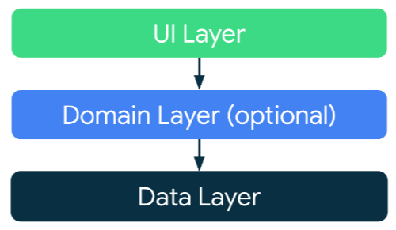
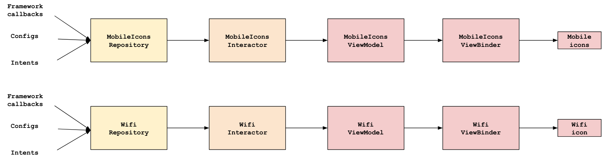
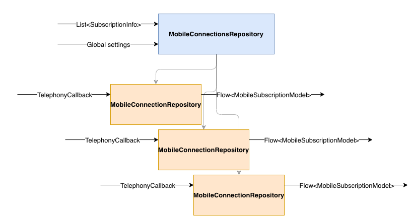

# Status Bar Data Pipeline

## Background

The status bar is the UI shown at the top of the user's screen that gives them
information about the time, notifications, and system status like mobile
conectivity and battery level. This document is about the implementation of the
wifi and mobile system icons on the right side:


In Android U, the data pipeline that determines what mobile and wifi icons to
show in the status bar has been re-written with a new architecture. This format
generally follows Android best practices to
[app architecture](https://developer.android.com/topic/architecture#recommended-app-arch).
This document serves as a guide for the new architecture, and as a guide for how
OEMs can add customizations to the new architecture.

## Architecture

In the new architecture, there is a separate pipeline for each type of icon. For
Android U, **only the wifi icon and mobile icons have been implemented in the
new architecture**.

As shown in the Android best practices guide, each new pipeline has a data
layer, a domain layer, and a UI layer:



The classes in the data layer are `repository` instances. The classes in the
domain layer are `interactor` instances. The classes in the UI layer are
`viewmodel` instances and `viewbinder` instances. In this document, "repository"
and "data layer" will be used interchangably (and the same goes for the other
layers).

The wifi logic is in `statusbar/pipeline/wifi` and the mobile logic is in
`statusbar/pipeline/mobile`.

#### Repository (data layer)

System callbacks, broadcast receivers, configuration values are all defined
here, and exposed through the appropriate interface. Where appropriate, we
define `Model` objects at this layer so that clients do not have to rely on
system-defined interfaces.

#### Interactor (domain layer)

Here is where we define the business logic and transform the data layer objects
into something consumable by the ViewModel classes. For example,
`MobileIconsInteractor` defines the CBRS filtering logic by exposing a
`filteredSubscriptions` list.

#### ViewModel (UI layer)

View models should define the final piece of business logic mapping to UI logic.
For example, the mobile view model checks the `IconInteractor.isRoaming` flow to
decide whether or not to show the roaming indicator.

#### ViewBinder

These have already been implemented and configured. ViewBinders replace the old
`applyMobileState` mechanism that existed in the `IconManager` classes of the
old pipeline. A view binder associates a ViewModel with a View, and keeps the
view up-to-date with the most recent information from the model.

Any new fields added to the ViewModel classes need to be equivalently bound to
the view here.

### Putting it all together

Putting that altogether, we have this overall architecture diagram for the
icons:



### Mobile icons architecture

Because there can be multiple mobile connections at the same time, the mobile
pipeline is split up hierarchically. At each level (data, domain, and UI), there
is a singleton parent class that manages information relevant to **all** mobile
connections, and multiple instances of child classes that manage information for
a **single** mobile connection.

For example, `MobileConnectionsRepository` is a singleton at the data layer that
stores information relevant to **all** mobile connections, and it also manages a
list of child `MobileConnectionRepository` classes. `MobileConnectionRepository`
is **not** a singleton, and each individual `MobileConnectionRepository`
instance fully qualifies the state of a **single** connection. This pattern is
repeated at the `Interactor` and `ViewModel` layers for mobile.



Note: Since there is at most one wifi connection, the wifi pipeline is not split
up in the same way.

## Customizations

The new pipeline completely replaces these classes:

*   `WifiStatusTracker`
*   `MobileStatusTracker`
*   `NetworkSignalController` and `NetworkSignalControllerImpl`
*   `MobileSignalController`
*   `WifiSignalController`
*   `StatusBarSignalPolicy` (including `SignalIconState`, `MobileIconState`, and
    `WifiIconState`)

Any customizations in any of these classes will need to be migrated to the new
pipeline. As a general rule, any change that would have gone into
`NetworkControllerImpl` would be done in `MobileConnectionsRepository`, and any
change for `MobileSignalController` can be done in `MobileConnectionRepository`
(see above on the relationship between those repositories).

### Sample customization: New service

Some customizations require listening to additional services to get additional
data. This new architecture makes it easy to add additional services to the
status bar data pipeline to get icon customizations.

Below is a general guide to how a new service should be added. However, there
may be exceptions to this guide for specific use cases.

1.  In the data layer (`repository` classes), add a new `StateFlow` that listens
    to the service:

    ```kotlin
    class MobileConnectionsRepositoryImpl {
      ...
      val fooVal: StateFlow<Int> =
        conflatedCallbackFlow {
          val callback = object : FooServiceCallback(), FooListener {
            override fun onFooChanged(foo: Int) {
              trySend(foo)
            }
          }

          fooService.registerCallback(callback)

          awaitClose { fooService.unregisterCallback(callback) }
        }
          .stateIn(scope, started = SharingStarted.WhileSubscribed(), FOO_DEFAULT_VAL)
    }
    ```

1.  In the domain layer (`interactor` classes), either use this new flow to
    process values, or just expose the flow as-is for the UI layer.

    For example, if `bar` should only be true when `foo` is positive:

    ```kotlin
    class MobileIconsInteractor {
      ...
      val bar: StateFlow<Boolean> =
        mobileConnectionsRepo
          .mapLatest { foo -> foo > 0 }
          .stateIn(scope, SharingStarted.WhileSubscribed(), initialValue = false)
    }
    ```

1.  In the UI layer (`viewmodel` classes), update the existing flows to process
    the new value from the interactor.

    For example, if the icon should be hidden when `bar` is true:

    ```kotlin
    class MobileIconViewModel {
      ...
      iconId: Flow<Int> = combine(
        iconInteractor.level,
        iconInteractor.numberOfLevels,
        iconInteractor.bar,
    ) { level, numberOfLevels, bar ->
      if (bar) {
        null
      } else {
        calcIcon(level, numberOfLevels)
      }
    }
    ```

## Demo mode

SystemUI demo mode is a first-class citizen in the new pipeline. It is
implemented as an entirely separate repository,
`DemoMobileConnectionsRepository`. When the system moves into demo mode, the
implementation of the data layer is switched to the demo repository via the
`MobileRepositorySwitcher` class.

Because the demo mode repositories implement the same interfaces as the
production classes, any changes made above will have to be implemented for demo
mode as well.

1.  Following from above, if `fooVal` is added to the
    `MobileConnectionsRepository` interface:

    ```kotlin
    class DemoMobileConnectionsRepository {
      private val _fooVal = MutableStateFlow(FOO_DEFAULT_VALUE)
      override val fooVal: StateFlow<Int> = _fooVal.asStateFlow()

      // Process the state. **See below on how to add the command to the CLI**
      fun processEnabledMobileState(state: Mobile) {
        ...
        _fooVal.value = state.fooVal
      }
    }
    ```

1.  (Optional) If you want to enable the command line interface for setting and
    testing this value in demo mode, you can add parsing logic to
    `DemoModeMobileConnectionDataSource` and `FakeNetworkEventModel`:

    ```kotlin
    sealed interface FakeNetworkEventModel {
      data class Mobile(
      ...
      // Add new fields here
      val fooVal: Int?
      )
    }
    ```

    ```kotlin
    class DemoModeMobileConnectionDataSource {
      // Currently, the demo commands are implemented as an extension function on Bundle
      private fun Bundle.activeMobileEvent(): Mobile {
        ...
        val fooVal = getString("fooVal")?.toInt()
        return Mobile(
          ...
          fooVal = fooVal,
        )
      }
    }
    ```

If step 2 is implemented, then you will be able to pass demo commands via the
command line:

```
adb shell am broadcast -a com.android.systemui.demo -e command network -e mobile show -e fooVal <test value>
```

## Migration plan

For Android U, the new pipeline will be enabled and default. However, the old
pipeline code will still be around just in case the new pipeline doesn’t do well
in the testing phase.

For Android V, the old pipeline will be completely removed and the new pipeline
will be the one source of truth.

Our ask for OEMs is to default to using the new pipeline in Android U. If there
are customizations that seem difficult to migrate over to the new pipeline,
please file a bug with us and we’d be more than happy to consult on the best
solution. The new pipeline was designed with customizability in mind, so our
hope is that working the new pipeline will be easier and faster.

Note: The new pipeline currently only supports the wifi and mobile icons. The
other system status bar icons may be migrated to a similar architecture in the
future.
